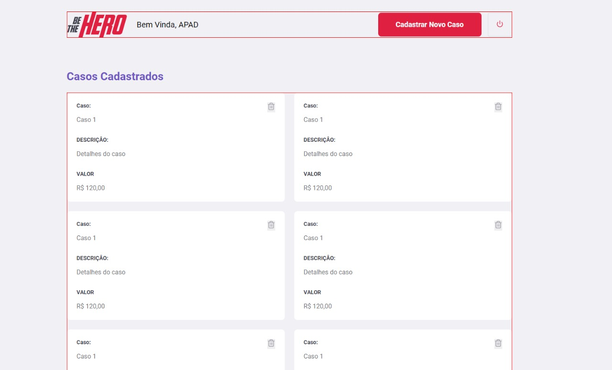
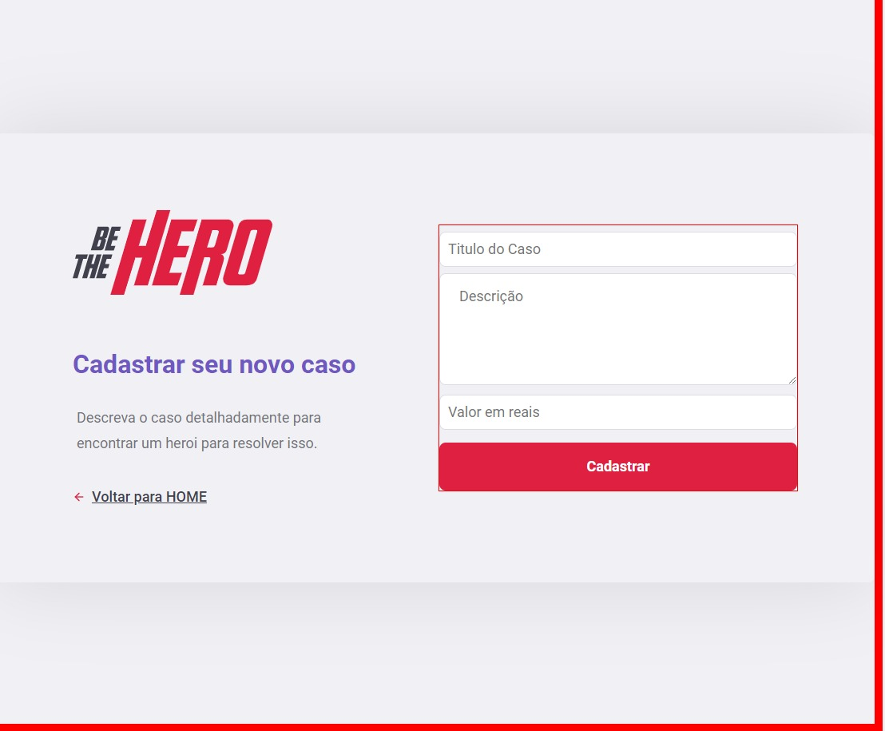
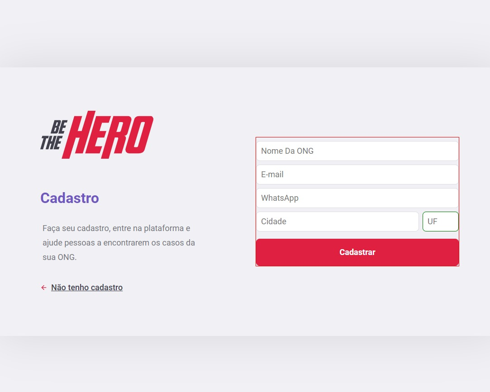

# Projeto de um sistema destinado a ONGs  

## Descrições de Tecnologias utilizadas

##### - Neste projeto utilizamos o NodeJs para o backend com o framework Express.
##### - Para manipular o banco de dados utilizamos o KnexBuilder.
##### - O banco de dados que é utilizado é o SQLite que é builded pelo Docker.
##### - Para o Frontend é utilizado o React para Web e para mobile o React Native.

### Funcionalidades do projeto 

##### - Criação de incidentes (OK)
##### - Deletar incidentes (OK)
##### - Criação de ONGs (OK)
##### - Criação de usuario (OK)
##### - Criação de perfil (OK)
##### - Criação de sessão (OK)
##### - Autenticação de usuario (OK)
##### - Criptografia de senhas (OK) 

